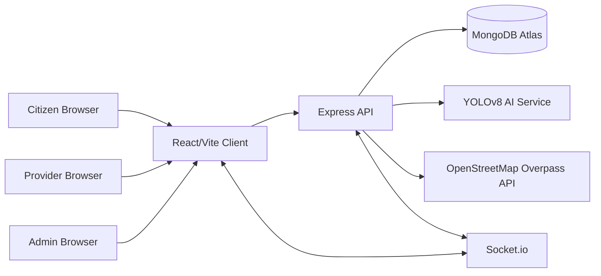

# CivicMate Architecture

## Runtime Topology

## Modules

- Auth: JWT access tokens, refresh tokens, bcrypt password hashing, role based access control.
- Complaints: issue reporting, image upload, AI classification, status tracking, assignment, notifications.
- AI: no-key local civic chatbot for assistance and YOLOv8-compatible image detection service.
- Emergency: OpenStreetMap Overpass nearby search for hospitals, police, fire stations, and ambulance services.
- Providers: verified marketplace for electricians, plumbers, carpenters, cleaners, and technicians.
- Notifications: persistent notifications plus Socket.io realtime delivery.
- Analytics: admin charts for category, status, location, priority, and monthly trends.

## Security

- Helmet for baseline HTTP hardening.
- CORS allowlist driven by `CLIENT_URL`.
- Rate limiting for `/api`.
- Express validator for request validation.
- JWT middleware and route-level RBAC.
- Mongoose schema validation and sanitized query filters.
- MongoDB GridFS uploads keep complaint images on the free database tier.
